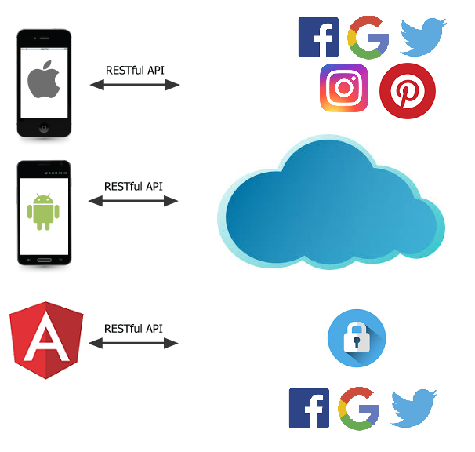

# Barbicha
Barbicha is a personal project to practice a full stack development effort. It is based on a fried desire, who is owner of a small barbershop in Brasilia. The project was designed to:
1. Be a fully function solution for practical use;
2. Implement a complete stack of components, using all the available options;
3. Implement the most modern alternatives for the solution;
4. Implement each and every techonology that could be applied to the problem.

## Business Case
Barbicha is composed of mobile and web applications with a backend on Cloud. It will permit customers schedulle appointments in the barbershop and the manager and barbers control and interact with the customer in real time. It will also permit the barbers individually and the barbershop as a company to publish media and promotion campaigns in numerous social media plataforms.

The main funcionalities of Barbicha are:
* [x] Barbershop can change visual and presentation of application;
* [x] Barbershop can register service catalog to be offered;
* [ ] Barbershop can register barbers and invite then to use the application;
* [ ] Barbershop can define working hours for default and special days;
* [ ] Barbers can control they calendar, informing out-of-service hours;
* [x] Customers can schedulle appointments;
* [ ] Customers can inform their data using third party providers (facebook, google, twitter);
* [x] Schedulled appointments could be changed by customer or barber responsible for;
* [ ] Customer, Barbers and Barbershop can send messages related to schedulled appointments;
* [ ] Customer, Barbers and Barbershop can review the quality of the service;
* [ ] Barbers and Barbershop can publish photos and videos to social media plataforms (Instagram, Facebook, Twitter, Pinterest);

## Base Architecture
Barbicha is composed of differente mobile clientes (iOS, Android and Mobile Web) that will be connected to a cloud backend to make customer requests. Customers can be register in the application or use their profiles in third party plataforms (Facebook, Google and Twitter) to authenticate and send the requested information.

    

### Frontend
The frontend of the app will be composed of the following applications:
1. iOS/Swift
2. Android/Kotlin;
3. Angular/Typescript.

### Backend
The plan is to develop three different backends, each of one composed of the alternatives of the main cloud providers available today:
1. AWS (Lambda, DynamoDB, SNS, Cognito);
2. Microsoft Azure;
3. GCP (Firebase Firestore, Firebase CLoud Messaging, Firebase Cloud Functions).

In the fist moment the application will be used on a single cloud provider at each instance (for example: all AWS services, or all Azure Services). For the future the application could be refactored to work with more than one cloud provider in the same instance.
